## **一句话结论**

**YOLO 作为视觉识别底座负责“看见和识别”，OCR 作为品牌文字线索负责“辅助筛选多品牌候选图片/区域”，结合人工复核、规则引擎和后续多模态理解，逐步形成门店陈列识别、审核、评分和经营建议能力。**

------

## **当前落地范围：多品牌包装识别 PoC**

当前项目先聚焦一个明确目标：

- 从业务 Excel 中下载门店整改后图片。
- 基于品牌标识库筛选疑似包含目标品牌的图片。
- 为多个品牌包装生成候选检测框。
- 人工复核候选框，形成 YOLO 多类别训练集。
- 使用 YOLO 训练多品牌包装检测模型。
- 推理时按品牌统计检测框数量，得到 `brand_counts` 和 `total_count`。

当前类别定义来自 `config/brand_keywords.json`，并由 `make brand-yaml` 写入 `config/generated/multibrand.yaml` / `config/generated/multibrand_pseudo.yaml`。传入 `BRAND=<品牌>` 时，会生成该品牌独立 YAML，并将 OCR、预标注、Label Studio 和训练输出隔离到 `datasets/<品牌>/`。

示例：

```text
0: softcare
1: kleesoft
2: doffi
...
```

每一个可辨认的目标品牌包装对应一个检测框，最终按品牌聚合为 `brand_counts`。

------

## **阶段0：数据导入与样本准备**

目标：从业务数据源收集未标注原始图片，形成可管理的数据池。

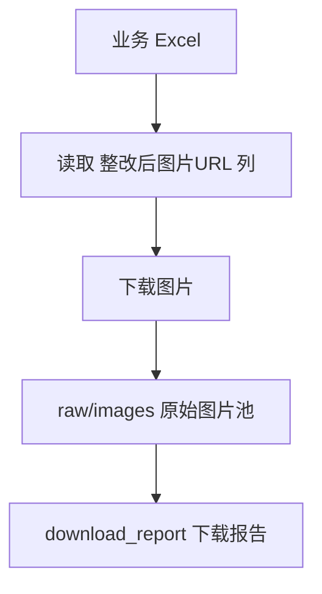

当前实现：

- 脚本：`scripts/data_import/import_images_from_excel.py`
- 输入 Excel：`/Users/guobiao/Downloads/8e96894159cc584f0c7a27faaa4acc45.xlsx`
- 图片 URL 列：`整改后图片URL`
- 原图目录：`datasets/multibrand/raw/images/`
- 下载报告：`datasets/multibrand/raw/metadata/download_report.csv`
- 图片命名：`row<Excel行号>_<原附件名称>.<后缀>`，保持和业务附件 hash 名称一致。
- 下载前会统计 Excel 去重后的有效 URL 是否均已有对应本地图片；全部完成时直接写入 `skipped` 报告并退出，不创建下载线程或网络请求；部分缺失时保留原有逐图下载和跳过逻辑。

注意：`raw/images` 中的图片没有标签，不能直接用于 YOLO 训练。

### 纸尿裤大类正式标注新流程

该流程独立于多品牌识别，当前目标只标注一个大类：`纸尿裤`。

- 数据按国家和版本隔离：`datasets/diaper_category/<国家>/<版本>/`。
- 原图目录：`datasets/diaper_category/<国家>/<版本>/raw/images/`。
- 下载报告：`datasets/diaper_category/<国家>/<版本>/raw/metadata/download_report.csv`。
- Label Studio 导入 JSON：`datasets/diaper_category/<国家>/<版本>/label_studio/diaper_category_label_studio_import.json`。
- 该流程只导入原始图片，不做 OCR 筛选，不做 YOLO-World/YOLOE 预标注，不生成 predictions。
- Label Studio 标签配置只有一个矩形框标签：`纸尿裤`。
- 人工标注导出后转换为 `images/{train,val,test}` 和 `labels/{train,val,test}`，YOLO 类别 ID 固定为 `0`。
- 单类别 YAML 生成到 `config/generated/diaper_category_<国家>_<版本>.yaml`。
- EC2 A10 训练目录建议为 `/home/ubuntu/yoloExample/`，其中数据保持同样的 `datasets/diaper_category/<国家>/<版本>/` 结构，训练输出为 `models/train/diaper_category_<国家>_<版本>/weights/best.pt`，最终模型导出为 `models/ec2/diaper_category/<国家>/<版本>/best.pt`。

------

## **阶段1：OCR 辅助筛选品牌候选图片**

目标：在未标注图片中，先用 OCR 识别包装或货架上的品牌文字，基于品牌标识库筛出更可能包含目标商品的图片，减少人工和自动预标注处理量。

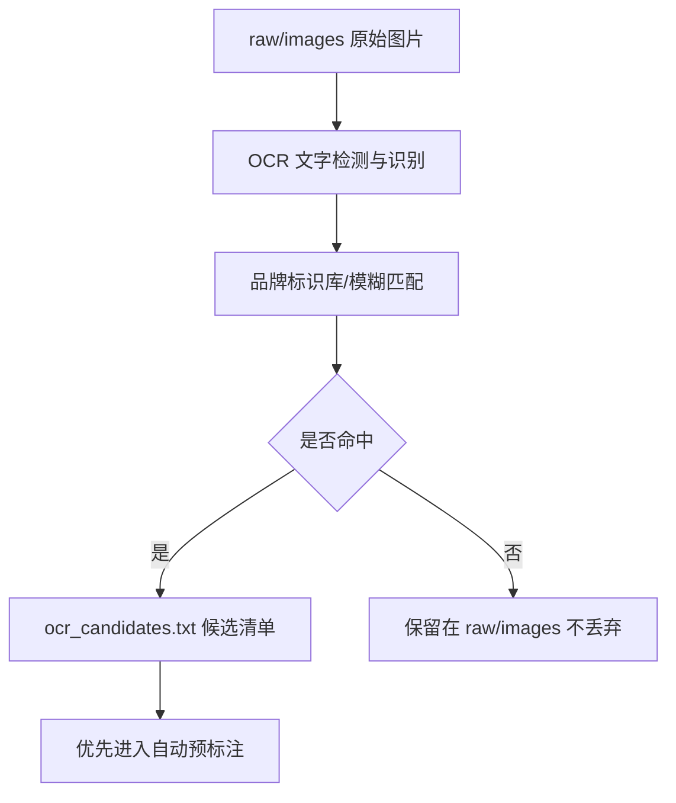

OCR 方案选择：

- 推荐生产方案：**PaddleOCR / PP-OCR**。中文和复杂场景能力强，适合后续生产化或服务化部署。
- 当前项目默认集成方案：**RapidOCR ONNX**。它基于 PP-OCR 思路，CPU 推理快，Mac 本地 PoC 更容易跑通；脚本同时保留 EasyOCR 作为备选引擎。
- 当前常规 OCR 已支持多线程并行识别，可通过 `OCR_WORKERS` / `--workers` 调整；`--workers 1` 可回退为串行。
- 新增本地大模型 OCR 分支：通过 Ollama 调用本机视觉模型识别图片文字，默认模型为已验证可识别样例图英文品牌的 `gemma3:12b`，也可切换 `qwen3.6:latest` 或 `minicpm-v:latest`。

当前实现：

- 常规 OCR 脚本：`scripts/ocr/filter_brand_candidates.py`
- Ollama 本地大模型 OCR 脚本：`scripts/ocr/filter_brand_candidates_llm.py`
- 品牌标识库：`config/brand_keywords.json`
- 输入：共享原图池 `datasets/multibrand/raw/images/`
- 输出目录：全品牌为 `datasets/multibrand/ocr/`；单品牌为 `datasets/<品牌>/ocr/`
- 候选清单：`datasets/<当前品牌>/ocr/metadata/ocr_candidates.txt`
- OCR 结果报告：
  - `datasets/<当前品牌>/ocr/metadata/ocr_softcare_report.csv`
  - `datasets/<当前品牌>/ocr/metadata/ocr_softcare_report.json`
- 每张图片完成 OCR 后立即追加 CSV 和候选清单，并原子更新完整 JSON；因此运行中断时已完成结果可直接读取。
- 两种 OCR 均支持 `--resume`；恢复时以 JSON 报告为准跳过已完成图片，并重建 CSV/候选清单保证输出一致。恢复前必须停止旧 OCR 进程，避免并发写入同一目录。

品牌标识库规则：

- 支持 JSON 或纯文本品牌库。
- 当前 JSON 中维护 `KLEESOFT`、`SOFTCARE`、`DOFFI`、`LAVITA`、`NICEDAY`、`MOSSE`、`MAYA`、`CLINCLEER`、`VEESPER`、`CUETTIE`、`T-GUARD`、`ATHENA`、`MCGEL`、`FASKIT`、`DR.X`、`Avril`、`DIAMOND`、`JIEBAI`、`MEDIPOWER`、`KINPOWER`。
- 脚本自动忽略纯数字序号、重复项和 `★` 这类纯符号。
- 可通过 `aliases` 维护 OCR 常见变体，例如 `SOFT CARE`、`KLEE SOFT`、`DR X`。
- `KLEESOFT` 已补充 `Keeson`、`Kleeson`、`Keesoft`、`KEESOTE`、`NEESOTE` 等商标 Logo 常见误识别别名。
- OCR 匹配过滤长度小于 4 的文本，并组合 `ratio` / `WRatio` / 降权 `partial_ratio`，避免 `Viva` 误命中 `LAVITA`、单字母 `K` 误命中 `KLEESOFT`。

局限：

- 货架图片中的品牌字样可能很小、反光、倾斜或被遮挡。
- OCR 命中只能说明“可能有目标品牌”，不能直接得到准确商品框。
- OCR 未命中不代表图片一定没有目标品牌，因此不应删除未命中图片，只应降低优先级。

------

## **阶段2：自动预标注与人工复核**

目标：使用开放词汇检测模型或 YOLOE 视觉提示生成候选框，再由人工修正，形成高质量 YOLO 标注。

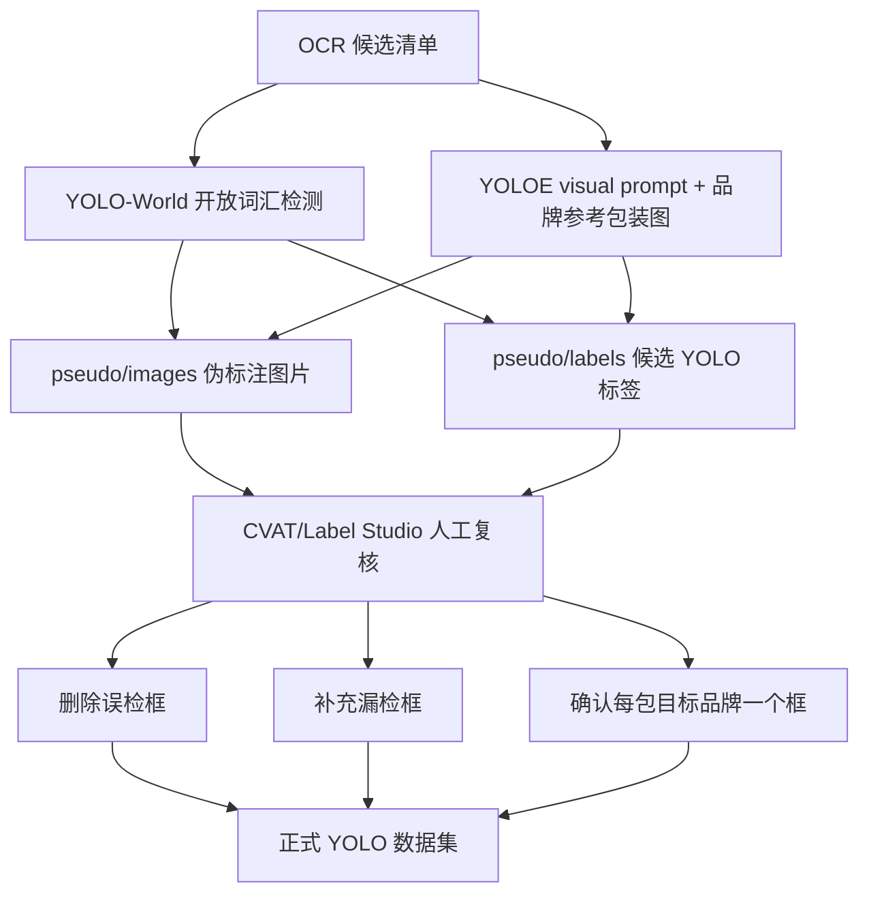

当前实现：

- 自动预标注脚本：`scripts/pseudo_label/generate_yolo_world.py`
- 默认模型：`models/yolov8s-world.pt`
- 支持参数：`--candidates-file`、`--brand-library`、`--brand-filter`、`--include-brand-package-prompts`、`--nms-iou`、`--containment-threshold`、`--max-area-ratio`
- OCR、预标注、Label Studio 多标签和 YOLO `names` 均以 `config/brand_keywords.json` 为统一类别来源。
- `BRAND=all` 默认使用品牌库所有启用品牌并保留稳定 `class_id`；`BRAND=SOFTCARE` 等单品牌模式会同步筛选该品牌，并重编号为单类别 ID `0`。
- 预标注会在同类别内做跨提示词 NMS、覆盖过滤和最大面积过滤，并默认启用跨品牌去重，减少同一商品被多个品牌提示词重复标注。
- `make brand-yaml` 根据当前品牌选择生成 `config/generated/<品牌>.yaml` 和对应伪标注 YAML。
- 伪标注目录：全品牌为 `datasets/multibrand/pseudo/`；单品牌为 `datasets/<品牌>/pseudo/`。
- 每张图片完成 YOLO-World 推理后立即写入图片、标签、JSON 和 CSV 元数据；中断后已完成部分保持可用。
- 新增 YOLO-World A/B 测试脚本：`scripts/pseudo_label/ab_test_yolo_world.py`；通过 `make yolo-world-ab-test` 对同一批图片依次运行 `yolov8s-world.pt`、`yolov8m-worldv2.pt`、`yolov8x-worldv2.pt`，输出逐模型 JSON/CSV、YOLO 标签、带框预览图和 Markdown 对比报告，用于选择更省人工复核成本的预标注模型。
- 新增 YOLOE visual prompt 预标注脚本：`scripts/pseudo_label/generate_yoloe_visual.py`。它从 `datasets/multibrand/visual_prompts/<品牌名>/` 读取参考包装图，默认把裁好的整张参考图作为参考框；若参考图不是裁剪包装图，可放同名 JSON sidecar 指定 `{"bbox": [x1, y1, x2, y2]}`。输出仍写入 `pseudo/images|labels|metadata`，因此可复用现有 Label Studio 导入流程。
- 新增品牌参考图 Excel 导入脚本：`scripts/data_import/import_visual_prompts_from_excel.py`。默认读取 `/Users/guobiao/Downloads/品牌图片_1786521889720.xlsx` 的 `brand` / `attach_file` 列，下载到 `datasets/multibrand/visual_prompts/<品牌名>/`，并在 `visual_prompts/metadata/download_report.csv|json` 写入下载报告；可通过 `make visual-prompts-import` 单独执行。
- YOLOE visual prompt 分支推荐模型顺序：`models/yoloe-26s-seg.pt` 先跑通流程，`models/yoloe-26m-seg.pt` 作为主力候选，`models/yoloe-26l-seg.pt` 验证效果上限。
- Label Studio 导入 JSON 生成：`scripts/label_studio/generate_import.py`
- Label Studio 本地导入：`scripts/label_studio/apply_import.py`
- Label Studio 导出转 YOLO：`scripts/label_studio/export_to_yolo.py`
- 多个 Label Studio 项目有效标注合并：`scripts/label_studio/merge_label_studio_exports.py`；`make diaper-merge-ls-projects LS_PROJECT_IDS=21,20` 会逐个导出项目，只保留含有效矩形框的任务，并按项目顺序去重合并到 `merged_label_studio_export.json`，后续可作为 `DIAPER_LS_EXPORT_PATH` 转 YOLO；`make diaper-merge-ls-projects-to-yolo LS_PROJECT_IDS=21,20` 会在合并后继续生成 YOLO `images/labels` 训练集。
- Makefile 顺序化流程：`step-1-import-excel` → `step-2-ocr` → `step-3-pseudo-label` 或 `step-3-pseudo-label-visual` → `step-4-import-ls` → `step-5-export-ls-to-train` → `step-6-train` → `step-7-validate`
- 本地大模型 OCR 分支流程：`workflow-to-ls-llm` 使用 `step-2-ocr-llm` 替代常规 OCR，其余预标注和 Label Studio 导入流程不变。
- YOLOE 视觉提示分支流程：`workflow-to-ls-visual` 使用 `step-3-pseudo-label-visual` 替代 YOLO-World 文本 prompt 预标注，其余 OCR 和 Label Studio 导入流程不变。
- 历史 Label Studio 项目：`http://localhost:9001/projects/2/data`；重新执行 `make ls-apply` 后以命令输出的新项目地址为准。
- 当前导入 JSON 包含 361 个任务，其中 153 个任务带预标注预测，共 1102 个候选框。
- 图片使用本地文件服务路径 `/data/local-files/?d=<absolute_path>`，避免远程 CDN CORS 问题。

Makefile 与 Label Studio 配置：

- 数据库：本地 PostgreSQL（数据库名 `labelstudio`，用户 `guobiao`）
- 端口：9001
- 本地文件服务：`LABEL_STUDIO_LOCAL_FILES_SERVING_ENABLED=true`，`LABEL_STUDIO_LOCAL_FILES_DOCUMENT_ROOT=/`
- 项目内临时目录：`.tmp/label-studio/`，不再使用 `/tmp` 作为 Label Studio shell/start 工作目录
- 首次初始化：`make ls-setup`（自动创建数据库并执行迁移）
- 启动：`make ls-start` 后台启动，日志写入 `logs/label-studio.log`，PID 写入 `logs/label-studio.pid`；`make help` 查看所有命令
- 停止：`make ls-stop` 停止占用 9001 端口的进程并清理 PID 文件
- 导入：`make ls-import-json && make ls-apply`。`ls-apply` 会同时创建 Local Files storage 权限记录，否则 `/data/local-files/` 可能返回 404。
- 导出训练集：人工复核完成后执行 `make step-5-export-ls-to-train BRAND=<品牌> LS_PROJECT_ID=<项目ID>`，导出 JSON 并转换为当前品牌 `datasets/<品牌>/images|labels/`。
- 端到端组合：`make workflow-to-ls [BRAND=<品牌>]` 执行到 LS 导入；`make workflow-to-ls-llm [BRAND=<品牌>]` 使用 Ollama 本地大模型 OCR 后执行到 LS 导入；`make workflow-to-ls-visual [BRAND=<品牌>]` 使用 YOLOE 视觉提示预标注后执行到 LS 导入；`make workflow-after-ls BRAND=<品牌> LS_PROJECT_ID=<项目ID>` 执行 LS 导出、训练和验证。
- 参数帮助：`make brand-list` 显示实时可用品牌；`make help` 会同时输出命令列表和常用参数默认值/可选值/效果说明；`make help-params` 只输出参数说明。重点参数包括 `BRAND`、`OCR_WORKERS`、`OCR_FUZZY_THRESHOLD`、`LLM_OCR_MODEL`、`LLM_OCR_WORKERS`、`PSEUDO_NMS_IOU`、`PSEUDO_CONTAINMENT`、`PSEUDO_MAX_AREA_RATIO`、`TRAIN_EPOCHS`、`TRAIN_DEVICE`。

推荐提示词：

```text
softcare diaper package
baby diaper package
diaper package
package
```

注意：

- 品牌包装提示词能提高召回，但误检会增加；当前通过 `PSEUDO_NMS_IOU`、`PSEUDO_CONTAINMENT`、`PSEUDO_MAX_AREA_RATIO`、`PSEUDO_CROSS_BRAND_DEDUP` 控制重复框、跨品牌重叠框和整图大框。
- YOLOE visual prompt 依赖参考包装图质量；优先使用清晰、只包含目标包装主体的 crop。若参考图是货架截图，必须用同名 JSON 指定包装 bbox，否则整张图会被当成“要找的外观”。
- 当前已改为多品牌多类别；每个品牌框必须选择对应品牌标签，不能把所有品牌都标成同一类。
- 伪标注只能作为人工复核起点，不能直接当作最终训练数据。
- 人工复核后的正式数据应放入：

```text
datasets/<当前品牌>/images/train|val|test
datasets/<当前品牌>/labels/train|val|test
```

------

## **阶段3：YOLO 基础陈列识别**

目标：训练多品牌多类别检测模型，识别商品、品牌和陈列数量等，替代人工审核中的基础计数工作。

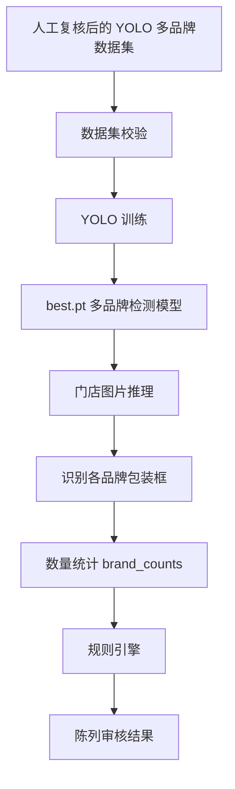

当前实现：

- 数据集配置：`config/generated/multibrand.yaml`；单品牌执行 `make brand-yaml BRAND=<品牌>` 后使用 `config/generated/<品牌>.yaml`。
- 数据校验：`scripts/training/validate_dataset.py`
- 训练脚本：`scripts/training/train.py`；支持 `--resume` 从 `models/train/<品牌>/weights/last.pt` 恢复。
- 推理脚本：`scripts/inference/predict.py`
- 推荐基线模型：`models/yolo26s.pt`
- 陈列照片模型版本选择：本地 PoC 和第一版业务验证优先 `yolo26s.pt`；生产服务器侧主力候选优先 `yolo26m.pt`；手机端本地实时检测优先 `yolo26n.pt` 或 `yolo26s.pt`；`yolo26l.pt` / `yolo26x.pt` 只建议作为效果上限实验，不作为首版默认。
- 训练与预标注所需的 `.pt` 权重统一存放在 `models/` 下，例如 `models/yolov8s-world.pt`、`models/clip/ViT-B-32.pt`、`models/multibrand-best.pt`。
- MacBook M1 Max 32G 推荐参数：

```bash
uv run python scripts/training/train.py \
  --base-model models/yolo26s.pt \
  --epochs 100 \
  --imgsz 960 \
  --batch -1 \
  --device mps
```


### 云端生产训练与推理建议

当单个国家达到数万张图片规模后，训练与推理建议拆分部署：

- 训练侧：优先使用 AWS NVIDIA GPU 实例训练 `yolo26m.pt`，第一阶段推荐 G6e/G5，训练瓶颈明显时再升级 P5/H100。
- 批量推理侧：优先使用 G6/L4 或 G5/A10G，通过 SageMaker Batch Transform、AWS Batch 或 ECS GPU 任务按国家、日期、门店批次横向扩展。
- 在线推理侧：如业务 APP 需要上传后准实时返回，优先使用 SageMaker Async Inference；如果只是后台审核，优先离线批量推理，不常驻大 GPU。
- 模型格式：训练保留 `best.pt`，生产推理优先导出 ONNX 与 TensorRT FP16；INT8 需要用真实门店图片校准并验证 mAP/召回率损失后再启用。
- 第一阶段不优先使用 Trainium/Inferentia，因为 YOLO + Ultralytics + CUDA/TensorRT 在 NVIDIA GPU 上落地链路更直接。

推理输出：

- `brand_counts`：各品牌包装数量
- `total_count`：全部目标品牌包装总数
- 每个检测框的类别、置信度、像素坐标
- 带框结果图
- JSON 结果文件

### 手机端直接拍照检测训练与部署路径

当业务目标从“后台处理业务图片”延展为“业务员在手机端拍照后立即检测”时，训练主链路仍然是 YOLO 检测训练，但需要把手机真实拍摄场景纳入训练集，并额外增加移动端模型导出与真机验证环节。

推荐路径：

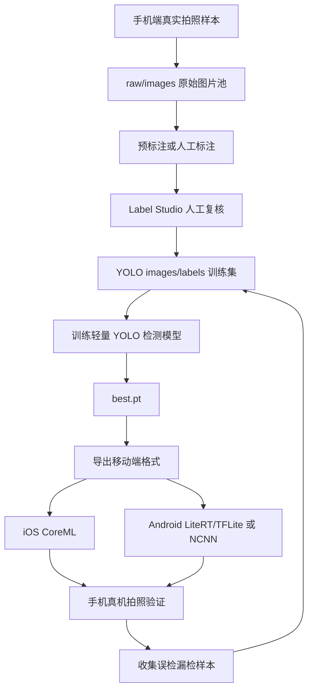

关键原则：

- 训练数据必须包含手机端真实分布：不同手机型号、竖拍/横拍、远近距离、模糊、反光、低光、倾斜、遮挡、货架拥挤、不同国家/门店类型；不能只依赖 Excel 历史图片。
- 当前项目的最终正式训练路径仍是 `datasets/<当前品牌或multibrand>/images/train|val|test` 与 `datasets/<当前品牌或multibrand>/labels/train|val|test`，`raw/images` 只作为未标注原始图片池。
- 手机端优先训练和评估轻量模型，例如 `yolo26n.pt` 或 `yolo26s.pt`；首版建议使用 `imgsz=640` 建立速度基线，若小包装漏检明显，再比较 `imgsz=960` 或更大模型。
- 如果是“手机拍照后上传服务器检测”，则训练流程不变，生产侧优先导出 ONNX/TensorRT；如果必须“手机本地离线检测”，则需要导出 iOS CoreML、Android LiteRT/TFLite 或 NCNN，并以真机延迟、包体、耗电和识别召回率作为上线门槛。
- OCR 仍主要用于训练前的数据筛选、人工复核辅助和服务端交叉验证；手机端第一版不建议把 OCR 和多模态模型都放到本地，避免端侧复杂度过高。
- 上线后持续回流手机端误检、漏检和低置信度图片，人工复核后追加到训练集，按国家/版本滚动训练。

------

## **阶段4：加入图片质量检测**

目标：解决照片质量差导致 OCR、自动预标注和 YOLO 识别不准的问题。

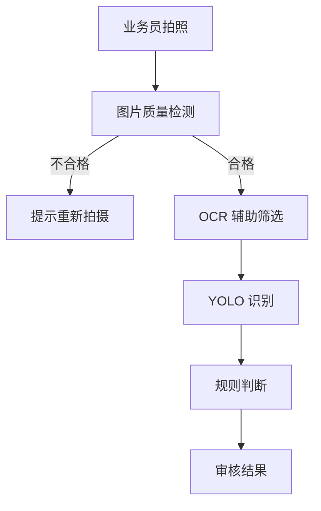

建议检测项：

- 模糊程度
- 亮度过暗/过曝
- 目标区域过小
- 大面积遮挡
- 图片分辨率不足

------

## **阶段5：YOLO + OCR + 多模态大模型**

目标：从“识别物体”升级到“理解门店场景”。

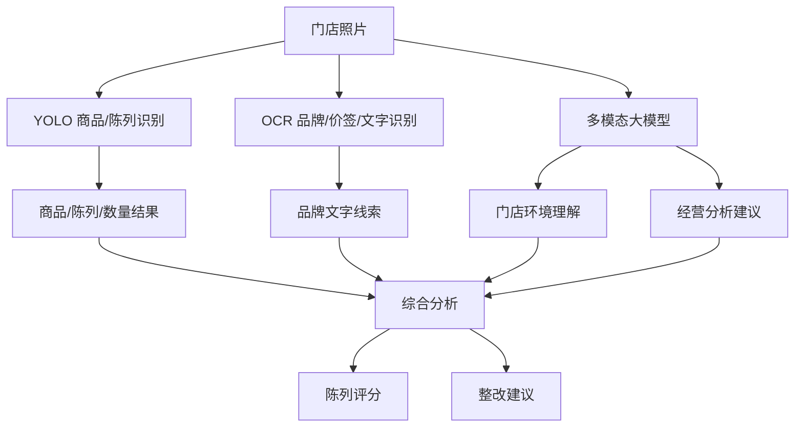

OCR 在该阶段的作用：

- 辅助识别品牌名、价签、货架标识。
- 与 YOLO 检测结果交叉验证，降低品牌误判。
- 帮助多模态模型理解门店文字环境。

------

## **阶段6：AI 自动生成门店画像和等级**

目标：解决访销员不会判断门店等级的问题，让 AI 根据照片反推门店价值。

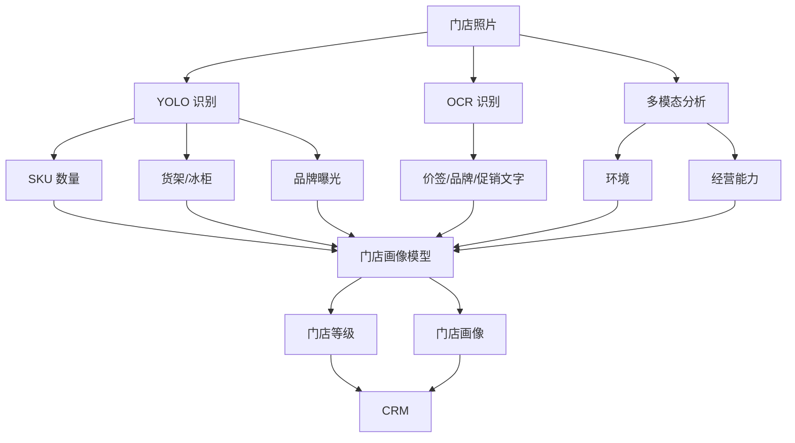

------

## **阶段7：最终智能门店 AI 架构**

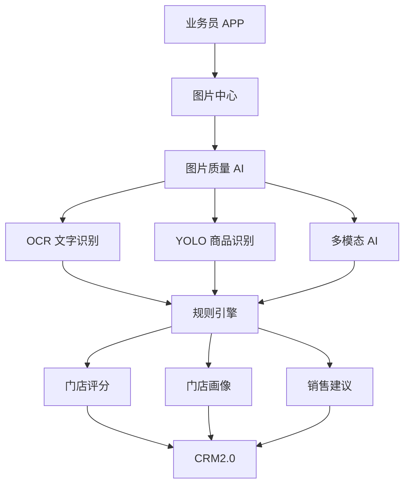

------

## **数据目录约定**

```text
datasets/multibrand/
├── raw/                         # Excel 下载的原始未标注图片
├── ocr/                         # OCR Softcare 筛选结果
├── visual_prompts/              # YOLOE visual prompt 品牌参考包装图
├── pseudo/                      # YOLO-World/YOLOE 自动预标注结果
├── images/                      # 人工复核后的正式训练图片
└── labels/                      # 人工复核后的正式 YOLO 标签
```

说明：

- `raw/`：原始数据池，不直接训练。
- `ocr/`：OCR 候选筛选结果，只用于排序和优先处理。
- `visual_prompts/`：按品牌目录存放参考包装图，例如 `visual_prompts/SOFTCARE/ref1.jpg`；真实参考图默认不提交到 Git。可用 `make visual-prompts-import` 从品牌图片 Excel 的 `brand` / `attach_file` 列自动下载，下载报告写入 `visual_prompts/metadata/`。
- `pseudo/`：自动生成候选框，必须人工复核。
- `images/`、`labels/`：正式训练数据，必须一一对应。

------

## **本地流程控制台**

为降低 Make 命令和参数记忆成本，项目新增轻量 Node 本地控制台：

```bash
npm start
# 或
make web-console
```

默认访问 `http://localhost:3000`。该控制台只作为本地编排和可视化层，不改变现有 OCR、YOLO-World、YOLOE、Label Studio、训练、推理和 EC2 脚本链路。

控制台能力：

- 使用左侧多级菜单按“图片来源/标注准备、Label Studio、本地 Mac 训练/推理、EC2 训练/推理/下载、维护工具、图片浏览”组织功能。
- 命令类功能可在左侧展开二级/三级子菜单；再次点击同一分组可折叠或展开，点击具体命令后右侧只展示该命令页面，包括说明、常用参数输入框、命令预览、复制和执行按钮，未填写参数继续使用 Makefile 默认值。
- 参数输入会按 Make 参数名缓存到浏览器 `localStorage`，同名参数在不同命令页面共享；清空某个输入框会删除该参数缓存并恢复使用 Makefile 默认值，页面也提供“清空参数缓存”按钮。
- 通过 Node `spawn('make', [target, 'KEY=value'])` 执行白名单 Make 目标，并在页面展示实时日志。
- 扫描 `datasets/`、`outputs/predict/`、`models/train/`、`artifacts/diaper_category/`、`data/samples/` 等本地目录，展示图片数量、训练集拆分、报告摘要和图片缩略图。
- 图片接口只允许读取项目内白名单目录的图片文件；EC2 命令默认 dry-run，必须显式设置 `EC2_EXECUTE=1` 才远端执行。

### 本地目录图片导入标注流程

除 Excel 下载导入外，项目支持把本机已有图片目录直接导入 Label Studio 做单类别矩形框标注。该入口适合临时样本、手机回流样本或人工整理好的图片目录。

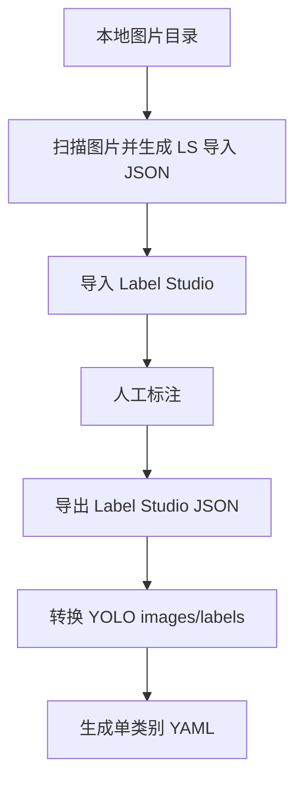

当前实现约定：

- 本地导入脚本：`scripts/label_studio/generate_local_dir_import.py`。
- Make 入口：`make 1-local-dir-workflow-to-ls LOCAL_IMAGES_DIR=<源图片目录> LOCAL_DATASET_NAME=<短名称> LOCAL_DATASET_ROOT=<导出目录> LOCAL_LABEL_NAME=<类别名>`。
- 人工标注后导出转换：`make 2-local-dir-workflow-after-ls LOCAL_DATASET_NAME=<短名称> LOCAL_DATASET_ROOT=<导出目录> LOCAL_LABEL_NAME=<类别名> LS_PROJECT_ID=<项目ID>`。
- `LOCAL_DATASET_NAME` 只能是短名称，不能填写路径；如果要指定导出位置，使用 `LOCAL_DATASET_ROOT`。
- 导入 JSON：`<LOCAL_DATASET_ROOT>/label_studio/local_dir_label_studio_import.json`。
- 标签配置：`<LOCAL_DATASET_ROOT>/label_studio/label_config.xml`。
- YOLO 训练集：`<LOCAL_DATASET_ROOT>/images/{train,val,test}` 和 `<LOCAL_DATASET_ROOT>/labels/{train,val,test}`。
- YOLO YAML：`config/generated/local_<LOCAL_DATASET_NAME>.yaml`。
- 本地 Web 控制台左侧菜单提供“图片来源 / 标注准备 → 本地目录 → LS”分组，可填写同样参数并执行。

为了衔接 EC2 训练，本地目录流程还提供专属 EC2 目录映射，默认远端结构为：

```text
datasets/local/<LOCAL_DATASET_NAME>/
config/generated/local_<LOCAL_DATASET_NAME>.yaml
models/ec2/local/<LOCAL_DATASET_NAME>/<EC2_RUN_NAME>/best.pt
artifacts/local/<LOCAL_DATASET_NAME>/<EC2_RUN_NAME>/
```

对应 Make 入口：

- `make local-dir-ec2-upload-data`：上传本地目录 YOLO 数据集和 YAML 到 EC2。
- `make local-dir-ec2-train`：在 EC2 训练本地目录数据集，训练规模由 `EC2_BASE_MODEL`、`EC2_TRAIN_EPOCHS`、`EC2_TRAIN_IMGSZ`、`EC2_TRAIN_BATCH`、`EC2_TRAIN_DEVICE` 等显式参数控制。
- `make local-dir-ec2-evaluate`：归档训练产物并生成评估摘要。
- `make local-dir-ec2-download-artifacts`：下载训练归档。
- `make local-dir-ec2-download-model`：下载 best.pt。

`EC2_RUN_NAME` 只用于模型、归档和报告目录命名，不再代表固定训练档位。这些 EC2 命令默认 dry-run，只有显式传 `EC2_EXECUTE=1` 才会真正连接远端执行。

### S3 训练图片管理与 EC2 下载训练流程

当本地图片数量较大，或希望 Label Studio 与 EC2 训练共享同一批图片地址时，项目新增 `brand-s3-ec2` 流程：

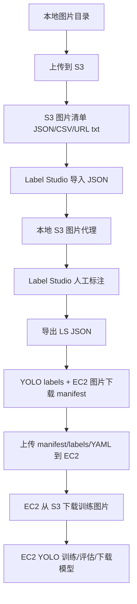

当前实现约定：

- 配置示例：`config/brand_s3_ec2.example.yaml`；本地真实配置使用 `config/brand_s3_ec2.local.yaml`，不提交 Git。
- Make 模块：`makefiles/brand-s3-ec2/Makefile.mk`，根 `Makefile` 已 include。
- S3 上传脚本：`scripts/s3/upload_images_to_s3.py`，输出 `datasets/s3/<S3_DATASET_NAME>/metadata/s3_images.json|csv` 和 `s3_download_urls.txt`；用户传入的 `S3_PREFIX` 是业务子目录，实际 S3 key 会自动归入 `yolo-training/<S3_PREFIX>/...`，若已传 `yolo-training/...` 则不会重复拼接；上传支持 `S3_UPLOAD_WORKERS` 并发和断点续传，已有成功记录且本地文件大小未变化的图片会跳过。`s3_images.json/csv` 是上传与 Label Studio 导入清单，不是 EC2 训练下载清单。
- Label Studio 导入脚本：`scripts/label_studio/generate_s3_import.py`，任务保留 `s3_uri`、`s3_bucket`、`s3_key`、`relative_path` 等字段。
- CORS 规避：默认使用 `scripts/s3/render_nginx_image_proxy.py` 生成本地 Nginx 配置，Label Studio 读取 `http://127.0.0.1:3010/image/<dataset>/<hash>.<ext>`；Nginx 负责回源 S3、补充 CORS header 并缓存图片。私有桶默认使用 `S3_NGINX_MODE=presign` 预签名 URL 映射，到期前需重新 reload；旧 `scripts/s3/s3_image_proxy.py` 保留为 `S3_PROXY_BACKEND=python` 回退方案。
- 标注后转换脚本：`scripts/label_studio/export_s3_single_class_to_yolo.py`，只生成 YOLO `labels/{train,val,test}` 和 `metadata/ec2_image_manifest.json|csv`，不在本地复制/下载训练图片。`ec2_image_manifest.json/csv` 是 EC2 训练下载清单，只包含标注转换后进入训练集的图片，并带有 `split`、`training_image_name`、`label_path`、`box_count` 等训练字段。
- 本地地址 LS 兼容转换脚本：`scripts/label_studio/export_local_s3_to_yolo.py`，用于“本地图片导入 LS 标注后，再把同一批图片上传 S3”的补充路径。它读取本地 LS 导出 JSON 和 `s3_images.json`，按 `local_path`、`relative_path`、`image_name` 匹配 S3 记录，生成 YOLO labels 与 `ec2_image_manifest.json|csv`，供 EC2 从 S3 下载训练图片。
- EC2 编排脚本：`scripts/ec2/s3_workflow.py`，负责上传 labels/manifest/YAML、在 EC2 按 `ec2_image_manifest.json` 从 S3 下载图片、训练、评估归档、下载模型；`scripts/cloud/ec2_s3_workflow.py` 保留为兼容旧路径的入口。若误把上传阶段的 `s3_images.json` 当成 EC2 下载清单，脚本会提示先执行 `2-brand-s3-workflow-after-ls` 或 `local-ls-s3-to-yolo` 生成 EC2 清单。EC2 图片下载支持 `S3_EC2_DOWNLOAD_MODE=auto|public|boto3`：`auto` 优先使用 manifest 里的公共 URL 或 `S3_PUBLIC_BASE_URL` 拼出的 URL，失败再回退 boto3；`public` 强制公共 URL 下载，不要求 EC2 配 AWS 凭证；`boto3` 保持 AWS SDK/IAM 下载。
- 脚本目录按职责拆分：`data_import/` 负责图片和参考图导入，`ocr/` 负责 OCR，`pseudo_label/` 负责 YOLO-World/YOLOE 预标注，`label_studio/` 负责导入导出转换，`training/` 负责本地训练和校验，`inference/` 负责推理，`s3/` 负责 S3 配置/上传/代理，`ec2/` 负责远端训练编排，`cloud/` 仅保留旧路径兼容入口。
- Web 控制台在“图片来源 / 标注准备 → 本地目录 → S3 → LS”和“EC2 训练 / 推理 / 下载 → S3 图片数据集 → EC2”中分别提供上传、代理、导入、标注后转换、EC2 下载/训练/评估/下载。
- EC2 命令仍默认 dry-run，只有显式传 `EC2_EXECUTE=1` 才会真正连接远端执行。

常用命令顺序：

```bash
# 1. 上传本地图片并生成 S3 清单
make brand-s3-upload-images \
  S3_DATASET_NAME=<name> \
  S3_LOCAL_IMAGES_DIR=/path/to/images \
  S3_BUCKET=<bucket> \
  S3_PREFIX=<name> \
  S3_UPLOAD_WORKERS=8

# 2. 启动本地 Nginx 代理，供 Label Studio 加载私有桶图片
make brand-s3-proxy-start \
  S3_DATASET_NAME=<name> \
  S3_BUCKET=<bucket> \
  S3_PROFILE=<profile> \
  S3_NGINX_MODE=presign

# 3. 生成并导入 Label Studio
make brand-s3-ls-import-json S3_DATASET_NAME=<name> S3_IMAGE_URL_MODE=nginx
make brand-s3-ls-apply S3_DATASET_NAME=<name>

# 4A. 如果 LS 项目本身使用 S3/Nginx 图片地址，标注完成后生成 YOLO labels 和 EC2 图片清单
make 2-brand-s3-workflow-after-ls \
  S3_DATASET_NAME=<name> \
  LS_PROJECT_ID=<项目ID> \
  S3_LS_TO_YOLO_CLEAR=1

# 4B. 如果 LS 项目使用本地图片地址、图片随后上传到 S3，则用本地 LS 导出匹配 S3 上传清单
make local-ls-s3-to-yolo \
  LOCAL_LS_EXPORT_PATH=/path/to/local_label_studio_export.json \
  S3_DATASET_NAME=<name> \
  S3_LOCAL_IMAGES_DIR=/path/to/original/images \
  S3_LS_TO_YOLO_CLEAR=1

# 5. EC2 侧上传 manifest/labels/YAML，下载 S3 图片并训练
make 3-brand-s3-workflow-ec2-train S3_DATASET_NAME=<name> EC2_BASE_MODEL=yolo26m.pt EC2_TRAIN_EPOCHS=100 EC2_TRAIN_IMGSZ=960 EC2_RUN_NAME=yolo26m_img960_e100 EC2_EXECUTE=1

# 如需排查单步日志，也可以拆开执行
make brand-s3-ec2-upload-manifest S3_DATASET_NAME=<name> EC2_EXECUTE=1
make brand-s3-ec2-download-images S3_DATASET_NAME=<name> EC2_EXECUTE=1
make brand-s3-ec2-train S3_DATASET_NAME=<name> EC2_BASE_MODEL=yolo26m.pt EC2_TRAIN_EPOCHS=100 EC2_TRAIN_IMGSZ=960 EC2_RUN_NAME=yolo26m_img960_e100 EC2_EXECUTE=1
```

------

## **当前演进路线**

**图片导入/手机拍照样本回流 → OCR 辅助筛选 → YOLO-World/YOLOE visual prompt 自动预标注 → 人工复核 → YOLO 训练 → YOLO+规则审核 → 手机端/服务端部署验证 → 图片质量控制 → YOLO+OCR+多模态理解 → AI 门店画像 → AI 销售助手。**
