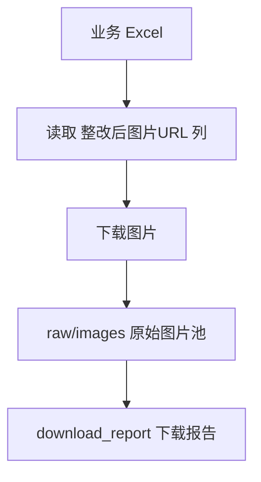
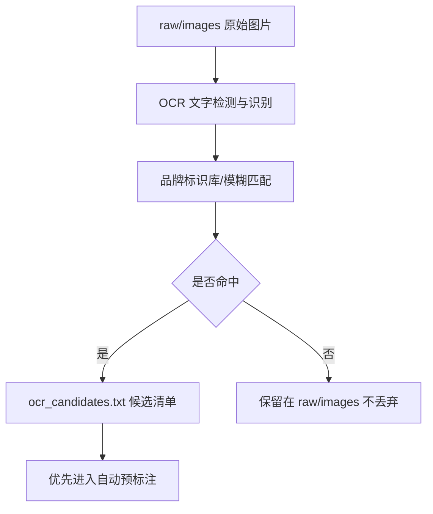
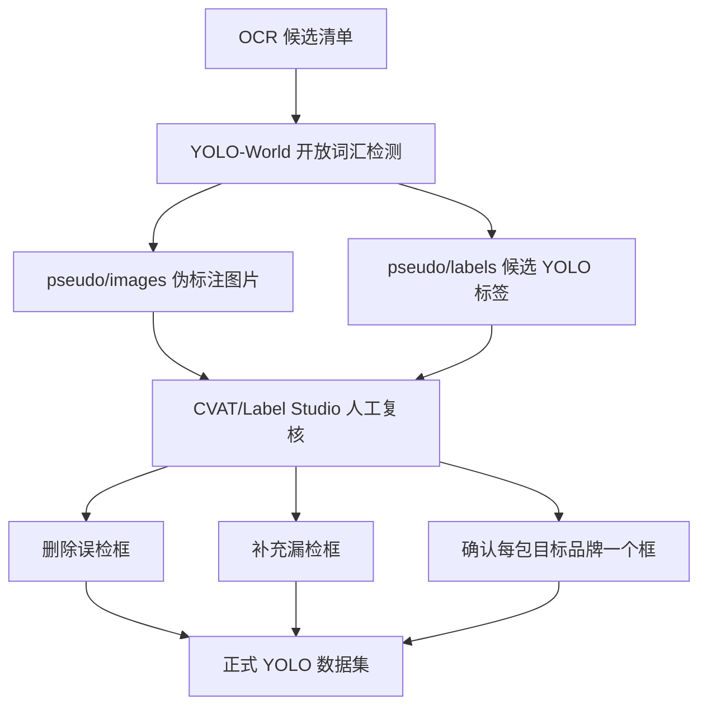
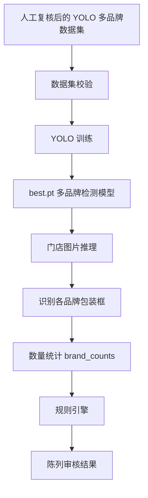
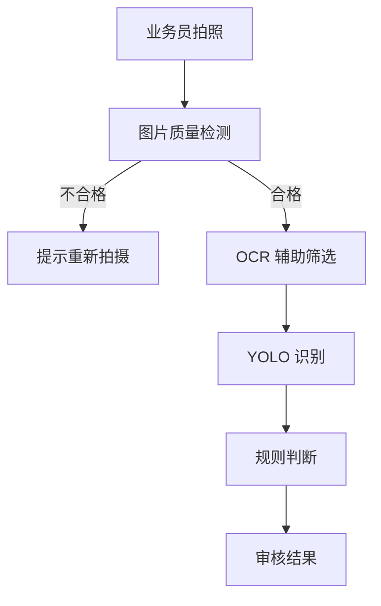
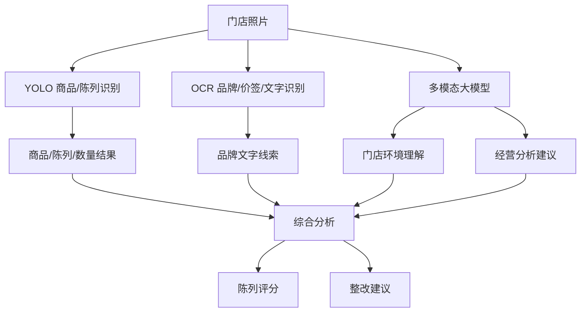
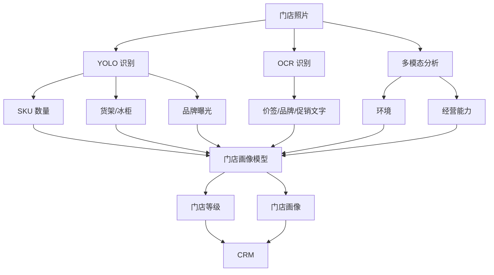
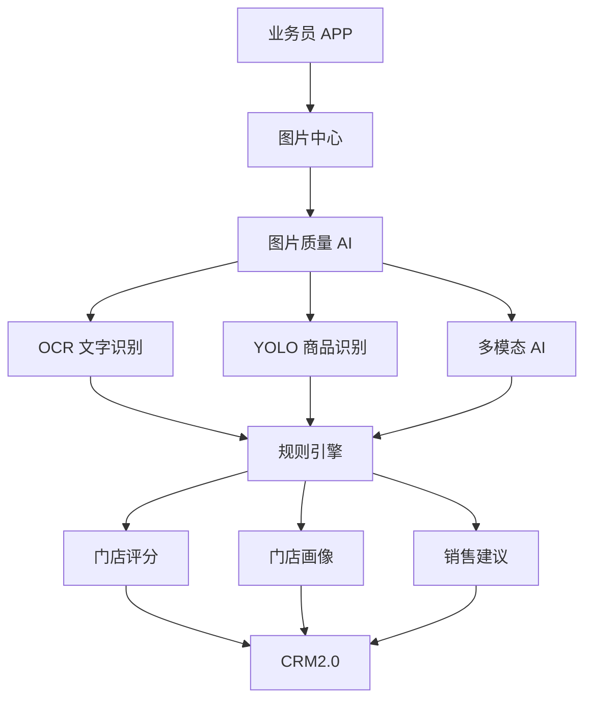

## **一句话结论**

**YOLO 作为视觉识别底座负责“看见和识别”，OCR 作为品牌文字线索负责“辅助筛选多品牌候选图片/区域”，结合人工复核、规则引擎和后续多模态理解，逐步形成门店陈列识别、审核、评分和经营建议能力。**

------

## **当前落地范围：多品牌包装识别 PoC**

当前项目先聚焦一个明确目标：

- 从业务 Excel 中下载门店整改后图片。
- 基于品牌标识库筛选疑似包含目标品牌的图片。
- 为多个品牌包装生成候选检测框。
- 人工复核候选框，形成 YOLO 多类别训练集。
- 使用 YOLO 训练多品牌包装检测模型。
- 推理时按品牌统计检测框数量，得到 `brand_counts` 和 `total_count`。

当前类别定义来自 `config/brand_keywords.json`，并由 `make brand-yaml` 写入 `config/generated/multibrand.yaml` / `config/generated/multibrand_pseudo.yaml`。传入 `BRAND=<品牌>` 时，会生成该品牌独立 YAML，并将 OCR、预标注、Label Studio 和训练输出隔离到 `datasets/<品牌>/`。

示例：

```text
0: softcare
1: kleesoft
2: doffi
...
```

每一个可辨认的目标品牌包装对应一个检测框，最终按品牌聚合为 `brand_counts`。

------

## **阶段0：数据导入与样本准备**

目标：从业务数据源收集未标注原始图片，形成可管理的数据池。



当前实现：

- 脚本：`scripts/data_import/import_images_from_excel.py`
- 输入 Excel：`/Users/guobiao/Downloads/8e96894159cc584f0c7a27faaa4acc45.xlsx`
- 图片 URL 列：`整改后图片URL`
- 原图目录：`datasets/multibrand/raw/images/`
- 下载报告：`datasets/multibrand/raw/metadata/download_report.csv`
- 图片命名：`row<Excel行号>_<原附件名称>.<后缀>`，保持和业务附件 hash 名称一致。

注意：`raw/images` 中的图片没有标签，不能直接用于 YOLO 训练。

------

## **阶段1：OCR 辅助筛选品牌候选图片**

目标：在未标注图片中，先用 OCR 识别包装或货架上的品牌文字，基于品牌标识库筛出更可能包含目标商品的图片，减少人工和自动预标注处理量。



OCR 方案选择：

- 推荐生产方案：**PaddleOCR / PP-OCR**。中文和复杂场景能力强，适合后续生产化或服务化部署。
- 当前项目默认集成方案：**RapidOCR ONNX**。它基于 PP-OCR 思路，CPU 推理快，Mac 本地 PoC 更容易跑通；脚本同时保留 EasyOCR 作为备选引擎。
- 当前常规 OCR 已支持多线程并行识别，可通过 `OCR_WORKERS` / `--workers` 调整；`--workers 1` 可回退为串行。
- 新增本地大模型 OCR 分支：通过 Ollama 调用本机视觉模型识别图片文字，默认模型为已验证可识别样例图英文品牌的 `gemma3:12b`，也可切换 `qwen3.6:latest` 或 `minicpm-v:latest`。

当前实现：

- 常规 OCR 脚本：`scripts/ocr/filter_brand_candidates.py`
- Ollama 本地大模型 OCR 脚本：`scripts/ocr/filter_brand_candidates_llm.py`
- 品牌标识库：`config/brand_keywords.json`
- 输入：共享原图池 `datasets/multibrand/raw/images/`
- 输出目录：全品牌为 `datasets/multibrand/ocr/`；单品牌为 `datasets/<品牌>/ocr/`
- 候选清单：`datasets/<当前品牌>/ocr/metadata/ocr_candidates.txt`
- OCR 结果报告：
  - `datasets/<当前品牌>/ocr/metadata/ocr_softcare_report.csv`
  - `datasets/<当前品牌>/ocr/metadata/ocr_softcare_report.json`
- 每张图片完成 OCR 后立即追加 CSV 和候选清单，并原子更新完整 JSON；因此运行中断时已完成结果可直接读取。

品牌标识库规则：

- 支持 JSON 或纯文本品牌库。
- 当前 JSON 中维护 `KLEESOFT`、`SOFTCARE`、`DOFFI`、`LAVITA`、`NICEDAY`、`MOSSE`、`MAYA`、`CLINCLEER`、`VEESPER`、`CUETTIE`、`T-GUARD`、`ATHENA`、`MCGEL`、`FASKIT`、`DR.X`、`Avril`、`DIAMOND`、`JIEBAI`、`MEDIPOWER`、`KINPOWER`。
- 脚本自动忽略纯数字序号、重复项和 `★` 这类纯符号。
- 可通过 `aliases` 维护 OCR 常见变体，例如 `SOFT CARE`、`KLEE SOFT`、`DR X`。
- `KLEESOFT` 已补充 `Keeson`、`Kleeson`、`Keesoft`、`KEESOTE`、`NEESOTE` 等商标 Logo 常见误识别别名。
- OCR 匹配过滤长度小于 4 的文本，并组合 `ratio` / `WRatio` / 降权 `partial_ratio`，避免 `Viva` 误命中 `LAVITA`、单字母 `K` 误命中 `KLEESOFT`。

局限：

- 货架图片中的品牌字样可能很小、反光、倾斜或被遮挡。
- OCR 命中只能说明“可能有目标品牌”，不能直接得到准确商品框。
- OCR 未命中不代表图片一定没有目标品牌，因此不应删除未命中图片，只应降低优先级。

------

## **阶段2：自动预标注与人工复核**

目标：使用开放词汇检测模型生成候选框，再由人工修正，形成高质量 YOLO 标注。



当前实现：

- 自动预标注脚本：`scripts/pseudo_label/generate_yolo_world.py`
- 默认模型：`models/yolov8s-world.pt`
- 支持参数：`--candidates-file`、`--brand-library`、`--brand-filter`、`--include-brand-package-prompts`、`--nms-iou`、`--containment-threshold`、`--max-area-ratio`
- OCR、预标注、Label Studio 多标签和 YOLO `names` 均以 `config/brand_keywords.json` 为统一类别来源。
- `BRAND=all` 默认使用品牌库所有启用品牌并保留稳定 `class_id`；`BRAND=SOFTCARE` 等单品牌模式会同步筛选该品牌，并重编号为单类别 ID `0`。
- 预标注会在同类别内做跨提示词 NMS、覆盖过滤和最大面积过滤，并默认启用跨品牌去重，减少同一商品被多个品牌提示词重复标注。
- `make brand-yaml` 根据当前品牌选择生成 `config/generated/<品牌>.yaml` 和对应伪标注 YAML。
- 伪标注目录：全品牌为 `datasets/multibrand/pseudo/`；单品牌为 `datasets/<品牌>/pseudo/`。
- 每张图片完成 YOLO-World 推理后立即写入图片、标签、JSON 和 CSV 元数据；中断后已完成部分保持可用。
- Label Studio 导入 JSON 生成：`scripts/label_studio/generate_import.py`
- Label Studio 本地导入：`scripts/label_studio/apply_import.py`
- Label Studio 导出转 YOLO：`scripts/label_studio/export_to_yolo.py`
- Makefile 顺序化流程：`step-1-import-excel` → `step-2-ocr` → `step-3-pseudo-label` → `step-4-import-ls` → `step-5-export-ls-to-train` → `step-6-train` → `step-7-validate`
- 本地大模型 OCR 分支流程：`workflow-to-ls-llm` 使用 `step-2-ocr-llm` 替代常规 OCR，其余预标注和 Label Studio 导入流程不变。
- 历史 Label Studio 项目：`http://localhost:9001/projects/2/data`；重新执行 `make ls-apply` 后以命令输出的新项目地址为准。
- 当前导入 JSON 包含 361 个任务，其中 153 个任务带预标注预测，共 1102 个候选框。
- 图片使用本地文件服务路径 `/data/local-files/?d=<absolute_path>`，避免远程 CDN CORS 问题。

Makefile 与 Label Studio 配置：

- 数据库：本地 PostgreSQL（数据库名 `labelstudio`，用户 `guobiao`）
- 端口：9001
- 本地文件服务：`LABEL_STUDIO_LOCAL_FILES_SERVING_ENABLED=true`，`LABEL_STUDIO_LOCAL_FILES_DOCUMENT_ROOT=/`
- 项目内临时目录：`.tmp/label-studio/`，不再使用 `/tmp` 作为 Label Studio shell/start 工作目录
- 首次初始化：`make ls-setup`（自动创建数据库并执行迁移）
- 启动：`make ls-start` 后台启动，日志写入 `logs/label-studio.log`，PID 写入 `logs/label-studio.pid`；`make help` 查看所有命令
- 停止：`make ls-stop` 停止占用 9001 端口的进程并清理 PID 文件
- 导入：`make ls-import-json && make ls-apply`。`ls-apply` 会同时创建 Local Files storage 权限记录，否则 `/data/local-files/` 可能返回 404。
- 导出训练集：人工复核完成后执行 `make step-5-export-ls-to-train BRAND=<品牌> LS_PROJECT_ID=<项目ID>`，导出 JSON 并转换为当前品牌 `datasets/<品牌>/images|labels/`。
- 端到端组合：`make workflow-to-ls [BRAND=<品牌>]` 执行到 LS 导入；`make workflow-to-ls-llm [BRAND=<品牌>]` 使用 Ollama 本地大模型 OCR 后执行到 LS 导入；`make workflow-after-ls BRAND=<品牌> LS_PROJECT_ID=<项目ID>` 执行 LS 导出、训练和验证。
- 参数帮助：`make brand-list` 显示实时可用品牌；`make help` 会同时输出命令列表和常用参数默认值/可选值/效果说明；`make help-params` 只输出参数说明。重点参数包括 `BRAND`、`OCR_WORKERS`、`OCR_FUZZY_THRESHOLD`、`LLM_OCR_MODEL`、`LLM_OCR_WORKERS`、`PSEUDO_NMS_IOU`、`PSEUDO_CONTAINMENT`、`PSEUDO_MAX_AREA_RATIO`、`TRAIN_EPOCHS`、`TRAIN_DEVICE`。

推荐提示词：

```text
softcare diaper package
baby diaper package
diaper package
package
```

注意：

- 品牌包装提示词能提高召回，但误检会增加；当前通过 `PSEUDO_NMS_IOU`、`PSEUDO_CONTAINMENT`、`PSEUDO_MAX_AREA_RATIO`、`PSEUDO_CROSS_BRAND_DEDUP` 控制重复框、跨品牌重叠框和整图大框。
- 当前已改为多品牌多类别；每个品牌框必须选择对应品牌标签，不能把所有品牌都标成同一类。
- 伪标注只能作为人工复核起点，不能直接当作最终训练数据。
- 人工复核后的正式数据应放入：

```text
datasets/<当前品牌>/images/train|val|test
datasets/<当前品牌>/labels/train|val|test
```

------

## **阶段3：YOLO 基础陈列识别**

目标：训练多品牌多类别检测模型，识别商品、品牌和陈列数量等，替代人工审核中的基础计数工作。



当前实现：

- 数据集配置：`config/generated/multibrand.yaml`；单品牌执行 `make brand-yaml BRAND=<品牌>` 后使用 `config/generated/<品牌>.yaml`。
- 数据校验：`scripts/training/validate_dataset.py`
- 训练脚本：`scripts/training/train.py`
- 推理脚本：`scripts/inference/predict.py`
- 推荐 baseline：`models/yolo26s.pt`
- 训练与预标注所需的 `.pt` 权重统一存放在 `models/` 下，例如 `models/yolov8s-world.pt`、`models/clip/ViT-B-32.pt`、`models/multibrand-best.pt`。
- MacBook M1 Max 32G 推荐参数：

```bash
uv run python scripts/training/train.py \
  --base-model models/yolo26s.pt \
  --epochs 100 \
  --imgsz 960 \
  --batch -1 \
  --device mps
```


### 云端生产训练与推理建议

当单个国家达到数万张图片规模后，训练与推理建议拆分部署：

- 训练侧：优先使用 AWS NVIDIA GPU 实例训练 `yolo26m.pt`，第一阶段推荐 G6e/G5，训练瓶颈明显时再升级 P5/H100。
- 批量推理侧：优先使用 G6/L4 或 G5/A10G，通过 SageMaker Batch Transform、AWS Batch 或 ECS GPU 任务按国家、日期、门店批次横向扩展。
- 在线推理侧：如业务 APP 需要上传后准实时返回，优先使用 SageMaker Async Inference；如果只是后台审核，优先离线批量推理，不常驻大 GPU。
- 模型格式：训练保留 `best.pt`，生产推理优先导出 ONNX 与 TensorRT FP16；INT8 需要用真实门店图片校准并验证 mAP/召回率损失后再启用。
- 第一阶段不优先使用 Trainium/Inferentia，因为 YOLO + Ultralytics + CUDA/TensorRT 在 NVIDIA GPU 上落地链路更直接。

推理输出：

- `brand_counts`：各品牌包装数量
- `total_count`：全部目标品牌包装总数
- 每个检测框的类别、置信度、像素坐标
- 带框结果图
- JSON 结果文件

------

## **阶段4：加入图片质量检测**

目标：解决照片质量差导致 OCR、自动预标注和 YOLO 识别不准的问题。



建议检测项：

- 模糊程度
- 亮度过暗/过曝
- 目标区域过小
- 大面积遮挡
- 图片分辨率不足

------

## **阶段5：YOLO + OCR + 多模态大模型**

目标：从“识别物体”升级到“理解门店场景”。



OCR 在该阶段的作用：

- 辅助识别品牌名、价签、货架标识。
- 与 YOLO 检测结果交叉验证，降低品牌误判。
- 帮助多模态模型理解门店文字环境。

------

## **阶段6：AI 自动生成门店画像和等级**

目标：解决访销员不会判断门店等级的问题，让 AI 根据照片反推门店价值。



------

## **阶段7：最终智能门店 AI 架构**



------

## **数据目录约定**

```text
datasets/multibrand/
├── raw/                         # Excel 下载的原始未标注图片
├── ocr/                         # OCR Softcare 筛选结果
├── pseudo/                      # YOLO-World 自动预标注结果
├── images/                      # 人工复核后的正式训练图片
└── labels/                      # 人工复核后的正式 YOLO 标签
```

说明：

- `raw/`：原始数据池，不直接训练。
- `ocr/`：OCR 候选筛选结果，只用于排序和优先处理。
- `pseudo/`：自动生成候选框，必须人工复核。
- `images/`、`labels/`：正式训练数据，必须一一对应。

------

## **当前演进路线**

**图片导入 → OCR 辅助筛选 → YOLO-World 自动预标注 → 人工复核 → YOLO 训练 → YOLO+规则审核 → 图片质量控制 → YOLO+OCR+多模态理解 → AI 门店画像 → AI 销售助手。**
